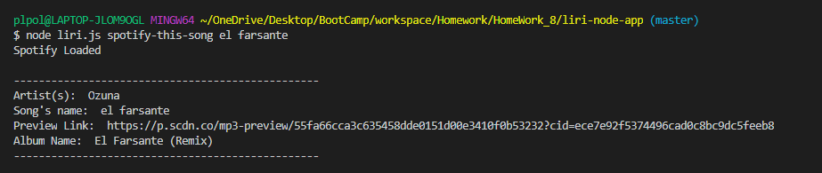
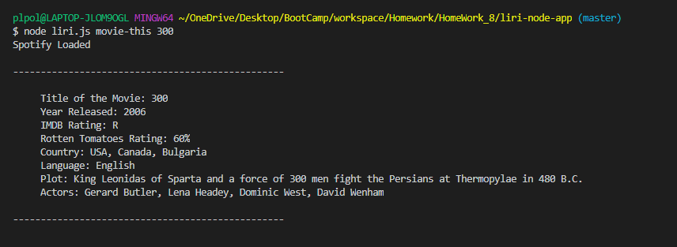

# LIRI-NODE-APP

### Overview

What is Liri? Liri is a _Language_ Interpretation and Recognition Interface. LIRI is a command line node app that takes in parameters and gives you back data.
The data that Liri will provide back is related to three different catergories. 

## What type of searches does Liri perform 

## Search for artist/band

- To inialize a song search the user must type in the following command in the terminal 'node liri spotify-this-song "title-of-song"'.
        Please note that "spotify-this-song" is highly important as it allows the application to identify that search the user is tring to execute is a search for a song. 
  
        -- The following responses are expected to be returned upon a successful song search. 
 
                * Name of the venue
                * Venue location
                * Date of the Event (use moment to format this as "MM/DD/YYYY")

 

## Search for song

- To inialize a song search the user must type in the following command in the terminal 'node liri spotify-this-song "title-of-song"'.
        Please note that "spotify-this-song" is highly important as it allows the application to identify that search the user is tring to execute is a search for a song. 
  
        -- The following responses are expected to be returned upon a successful song search. 

                * Artist(s)
                * The song's name
                * A preview link of the song from Spotify
                * The album that the song is from

 

## Search for movie 

- To inialize a movie search the user must type in the following command in the terminal 'node liri movie-this "title-of-movie"'.
        Please note that "movie-this" is highly important as it allows the application to identify that search the user is tring to execute is a search for a movie.
 
        -- The following responses are expected to be returned upon a successful movie search. 

                * Title of the movie.
                * Year the movie came out.
                * IMDB Rating of the movie.
                * Rotten Tomatoes Rating of the movie.
                * Country where the movie was produced.
                * Language of the movie.
                * Plot of the movie.
                * Actors in the movie.

  

  ## Default search if no input is found

  * Defaulted value if no artist/band is provided "Ozuna".
  * Defaulted value if no song is provided "The Sign" by Ace of Base.
  * Defaulted value if no movie is provided "The Sign" by Ace of Base.'Mr. Nobody.'

  Thank you for viewing my LIRI-NODE-APP for any question please feel to visit my website 